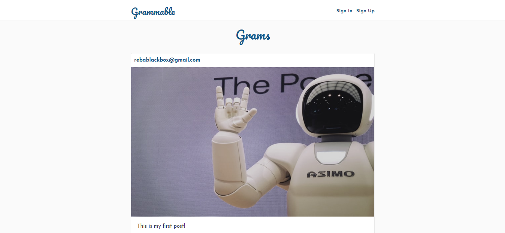
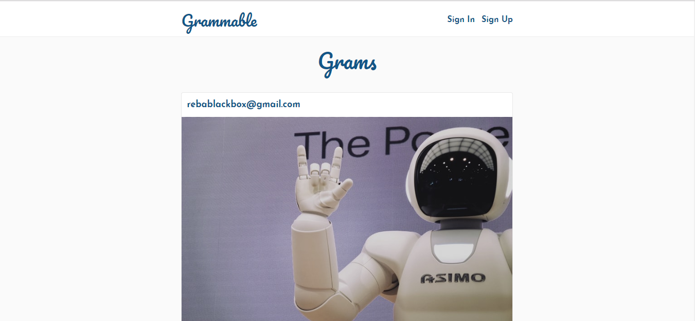
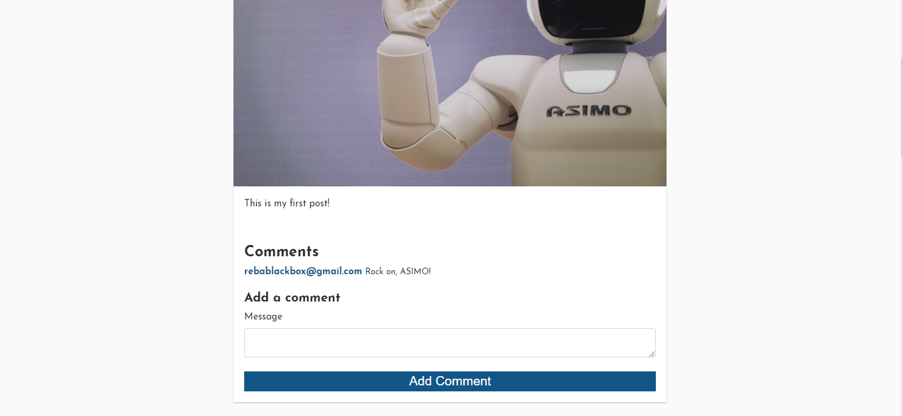
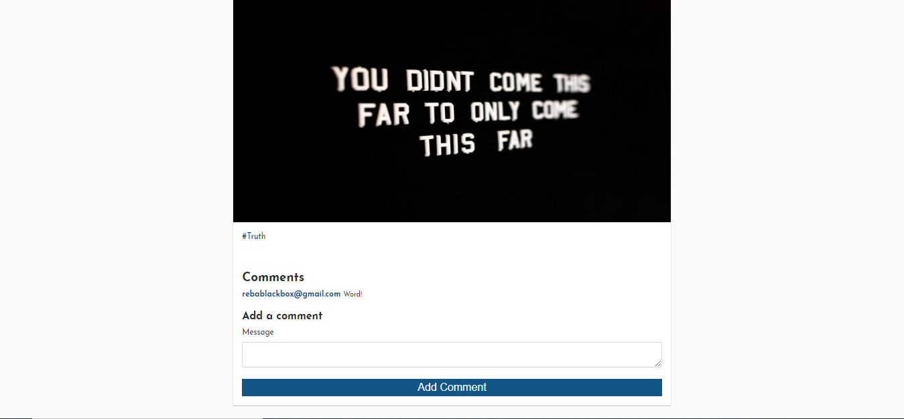
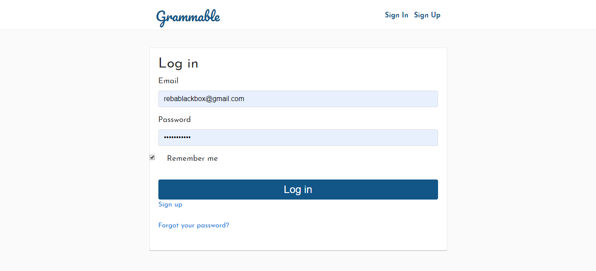
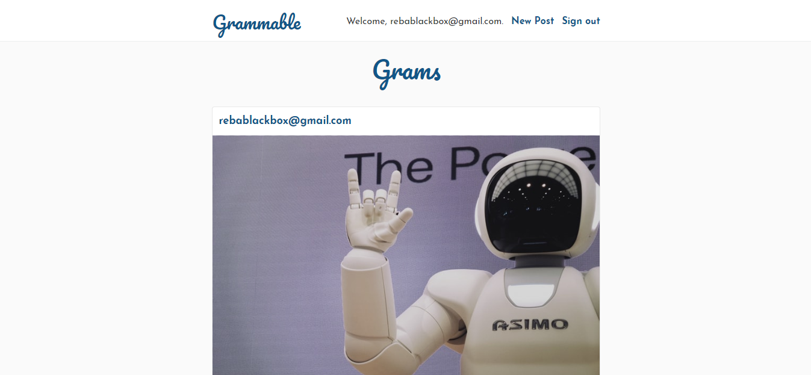
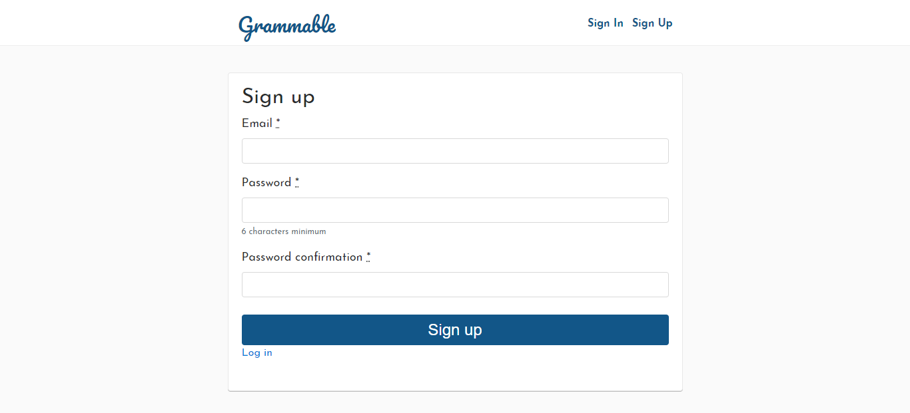
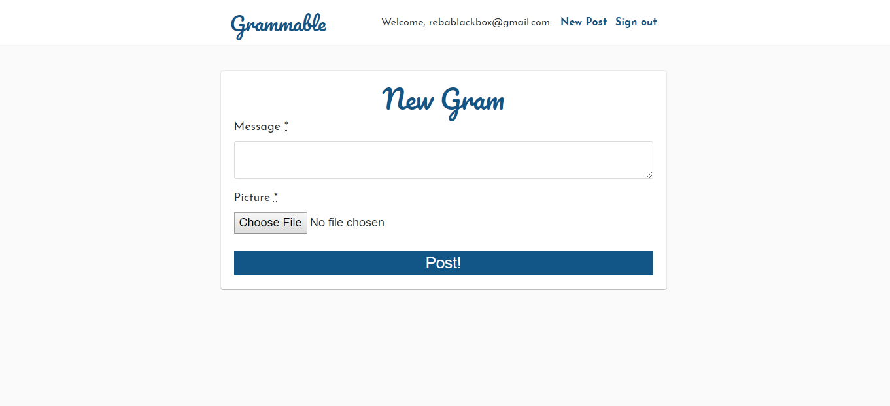

# Grammable

Grammable is an Instagram clone that was built using industry-standard, test-driven development following numerous red/green/refactor cycles. Uses Git and GitHub for version control, and deployed via Heroku.

Home/Landing Page

A closer look at the Home/Landing Page

Grams

Grams Continued

Login

View for a logged-in user

Signup

New Gram

## Getting Started

* Clone the repository
* Run bundle install
* Create and migrate the PotgreSQL database with rake db:create and rake db:migrate
* Start the server using rails server -b 0.0.0.0 -p 3000
* Run the app on localhost:3000

### Prerequisites

* Rails v. 5.0.0
* Ruby v. 2.6.3
* JavaScript
* PostgreSQL
* HTML
* CSS/SCSS

## Deployment

Deployed using Heroku (https://www.heroku.com)

* Navigate to https://grammable-reba-pipes.herokuapp.com
* Use guest login or signup
* Guest login information:
    Email/Username: testemail@testing.com
    Password: 123456

## Built With

* Ruby on Rails
* JavaScript
* Amazon Web Services API (AWS/S3)

## Features

* User authenitcation (Devise)
* Amazon Web Services API (AWS/S3)
* Image resizing
* Mobile optimization (responsive design)
* Commenting

## Meta

Reba Pipes

Email: pipes.reba@gmail.com

LinkedIn: (https://linkedin.com/in/rebapipes)

GitHub: (https://github.com/rebapipes/grammable)

Heroku: (https://grammable-reba-pipes.herokuapp.com)

Portfolio: (https://rebapipes.netlify.com)

Medium Blog: (https://medium.com/@rebapipes)

## Contributing

Reba Pipes (https://github.com/rebapipes)

## Versioning

Git & GitHub used for versioning (https://github.com/) 

## Authors

Reba Pipes (https://github.com/rebapipes)

## License

This project is licensed under the MIT License - see the [LICENSE.md](LICENSE.md) file for details